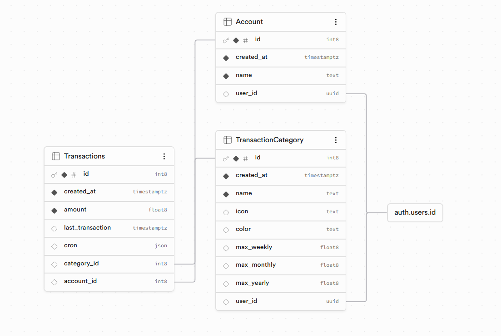

# Finance Tracker

Simple application for tracking personal income and expenses with clear insights and analytics.

---

## About

Finance Tracker is a web application designed to help users manage their personal finances. It allows users to record transactions, categorize them as income or expenses, and analyze their financial activity over time.

---

## Features

- Add income and expense transactions
- Categorize transactions
- View transaction history
- Monthly summaries
- Basic analytics and insights
- User management

---

## Tech Stack

- **Framework:** Next.js (Fullstack – frontend + backend API routes)
- **Database & Auth:** Supabase (PostgreSQL, Authentication)
- **ORM / Querying:** Supabase client
- **Styling:** Tailwind CSS
- **Deployment:** Vercel

---

## Database Schema

## Table `Account`

### Columns

| Name         | Type          | Constraints      |
| ------------ | ------------- | ---------------- |
| `id`         | `int8`        | Primary Identity |
| `created_at` | `timestamptz` |                  |
| `name`       | `text`        |                  |
| `user_id`    | `uuid`        | Nullable         |

## Table `TransactionCategory`

### Columns

| Name          | Type          | Constraints      |
| ------------- | ------------- | ---------------- |
| `id`          | `int8`        | Primary Identity |
| `created_at`  | `timestamptz` |                  |
| `name`        | `text`        |                  |
| `icon`        | `text`        | Nullable         |
| `color`       | `text`        | Nullable         |
| `max_weekly`  | `float8`      | Nullable         |
| `max_monthly` | `float8`      | Nullable         |
| `max_yearly`  | `float8`      | Nullable         |
| `user_id`     | `uuid`        | Nullable         |

## Table `Transactions`

### Columns

| Name               | Type          | Constraints      |
| ------------------ | ------------- | ---------------- |
| `id`               | `int8`        | Primary Identity |
| `created_at`       | `timestamptz` |                  |
| `amount`           | `float8`      |                  |
| `last_transaction` | `timestamptz` | Nullable         |
| `cron`             | `json`        | Nullable         |
| `category_id`      | `int8`        | Nullable         |
| `account_id`       | `int8`        | Nullable         |

---

## Screenshots

_Add application screenshots here_

---

## Roadmap

- [ ] Budget planning
- [ ] Notifications
- [ ] Multi-currency support
- [ ] Mobile version

---

## Author

Lukáš Dvorský
